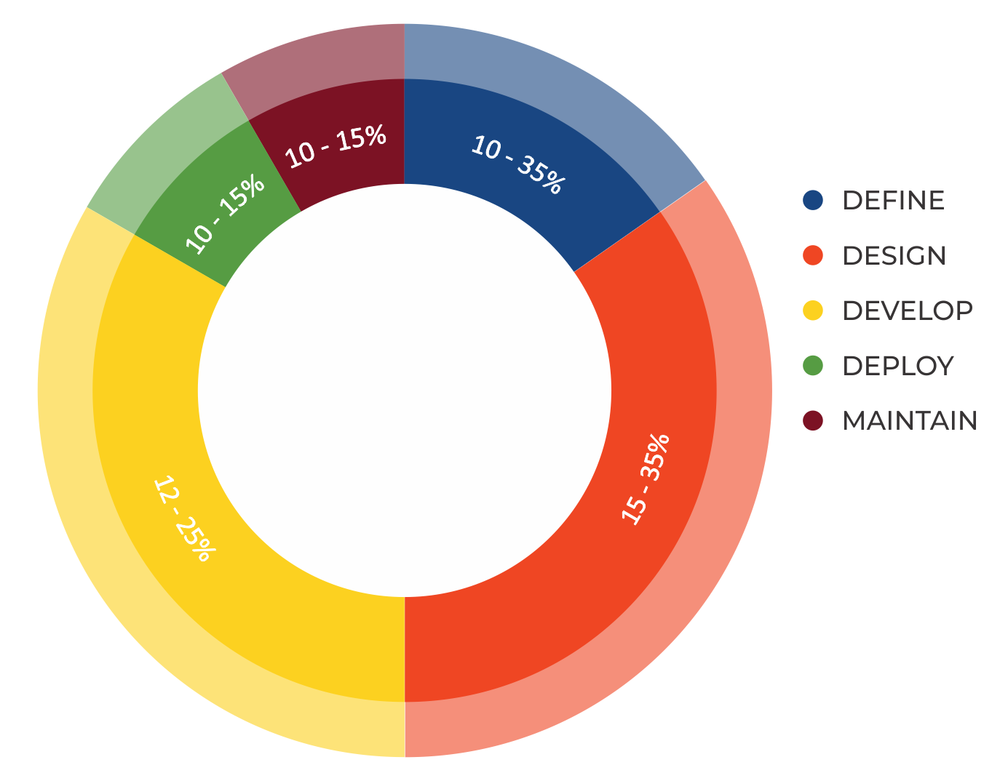

# 介绍

## OWASP 测试项目

OWASP 测试项目已发展多年。该项目的目的是帮助人们了解测试网络应用程序的*what*、*why*、*when*、*where*和*how*。该项目提供了一个完整的测试框架，而不仅仅是一个简单的检查清单或应处理问题的方法。读者可以将此框架作为模板，建立自己的测试程序，或对他人的程序进行鉴定。本测试指南详细介绍了一般测试框架和在实践中实施该框架所需的技术。

事实证明，编写《测试指南》是一项艰巨的任务。既要达成共识，又要编写出既能让人们应用指南中所述概念，又能让他们在自己的环境和文化中开展工作的内容，这是一项挑战。将网络应用程序测试的重点从渗透测试转向软件开发生命周期中的综合测试也是一项挑战。

不过，该小组对该项目的结果非常满意。许多行业专家和安全专业人士（其中一些人在全球最大的公司中负责软件安全）正在验证该测试框架。该框架可帮助企业测试其网络应用程序，从而构建可靠、安全的软件。该框架并不是简单地强调薄弱环节，尽管这肯定是许多 OWASP 指南和清单的副产品。因此，我们必须就某些测试技术的适当性做出艰难的决定。该小组完全理解，并非所有人都会同意所有这些决定。但是，OWASP 能够站在制高点上，在共识和经验的基础上，通过宣传和教育，逐渐改变文化。

本指南的其余部分安排如下：介绍部分包括测试网络应用程序的前提条件和测试范围，还包括成功测试的原则和测试技术、报告的最佳实践以及安全测试的商业案例。第 3 章介绍 OWASP 测试框架，并结合软件开发生命周期的各个阶段解释其技术和任务。第 4 章介绍如何通过代码检查和渗透测试来测试特定漏洞（如 SQL 注入）。

### 安全性衡量：不安全软件的经济学原理

下面这段话概括了软件工程的基本原则 [控制软件项目： 管理、测量和估算](https://isbnsearch.org/isbn/9780131717114) by [Tom DeMarco](https://en.wikiquote.org/wiki/Tom_DeMarco):

> 你无法控制你无法测量的东西。

安全测试也不例外。不幸的是，衡量安全性是一个众所周知的困难过程。

需要强调的一点是，安全测试既涉及具体的技术问题（如某个漏洞的普遍程度），也涉及这些问题如何影响软件的经济效益。大多数技术人员至少了解基本问题，或者他们可能对漏洞有更深入的了解。遗憾的是，很少有人能够将这些技术知识转化为经济问题，并量化漏洞对应用程序所有者业务的潜在成本。如果不能做到这一点，管理者们就无法获得准确的安全投资回报，也就无法为软件安全分配适当的预算。

尽管估算不安全软件的成本似乎是一项艰巨的任务，但在这方面已经开展了大量工作。2020 年，IT 软件质量联盟[摘要](https://www.it-cisq.org/the-cost-of-poor-software-quality-in-the-us-a-2020-report/)：

> ......2018年美国劣质软件的成本约为2.84万亿美元...

本文档中描述的框架鼓励人们在整个开发过程中衡量安全性。这样，人们就可以将不安全软件的成本与其对业务的影响联系起来，从而制定适当的业务流程，并分配资源来管理风险。请记住，测量和测试网络应用程序比测量和测试其他软件更为重要，因为网络应用程序会通过互联网暴露给数百万用户。

### 什么是测试 ?

在网络应用程序的开发生命周期中，许多事情都需要进行测试，但测试究竟意味着什么呢？牛津英语词典》将 "测试 "定义为：

> **测试**（名词）：旨在确定某物的质量、性能或可靠性的程序，尤其是在其被广泛使用之前。

在本文中，测试是将系统或应用程序的状态与一系列标准进行比较的过程。在安全行业，人们经常根据一套既不明确也不完整的内心的标准进行测试。因此，许多局外人认为安全测试是一门黑色艺术。本文档旨在改变这种看法，让没有深入安全知识的人更容易在测试中有所作为。

### 为什么要进行测试 ?

本指南旨在帮助企业了解测试计划的组成，并帮助他们确定建立和运行现代网络应用程序测试计划所需的步骤。本指南概括了制定全面网络应用程序安全计划所需的要素。本指南可用作参考和方法论，帮助确定现有实践与行业最佳实践之间的差距。通过本指南，企业可以与业内同行进行比较，了解测试和维护软件所需的资源规模，或为审计做好准备。本章不涉及如何测试应用程序的技术细节，因为本章旨在提供一个典型的安全组织框架。关于如何测试应用程序的技术细节，作为渗透测试或代码审查的一部分，将在本文档的其余部分中阐述。

### 什么时候开展测试 ?

如今，大多数人在软件已经创建并进入其生命周期的部署阶段（即代码已经创建并实例化为可运行的网络应用程序）之前，都不会对软件进行测试。这通常是一种非常无效且成本高昂的做法。防止安全漏洞出现在生产应用程序中的最佳方法之一是改进**软件开发生命周期（SDLC）**，将安全性纳入其每个阶段。SDLC 是强加给软件工件开发的一种结构。如果您的环境中目前没有使用 SDLC，那么现在就应该选择一种！下图显示了一个通用的 SDLC 模型，以及在此模型中修复安全漏洞的（估计）增加成本。

\
*图 2-1: 通用 SDLC 模型*

公司应检查其整体的 SDLC，以确保安全是开发过程中不可分割的一部分。SDLC 应包括安全测试，以确保在整个开发过程中充分考虑到安全问题，并采取有效的控制措施。

### 测试什么？

将软件开发视为人员、流程和技术的结合可能会有所帮助。如果这些都是 "创造 "软件的因素，那么顺理成章的是，这些都是必须进行测试的因素。如今，大多数人通常会对技术或软件本身进行测试。

有效的测试程序应包含以下测试组件：

- **人员** – 确保开展充分的教育和宣传活动；
- **流程** – 确保有适当的政策和标准，并确保人们知道如何遵守这些政策；
- **技术** – 确保该流程得到有效实施。

除非采用整体方法，否则仅对应用程序的技术实施进行测试将无法发现可能存在的管理或操作漏洞。通过对人员、政策和流程进行测试，企业可以捕捉到日后会表现为技术缺陷的问题，从而及早消除错误并找出缺陷的根本原因。同样，如果只测试系统中可能存在的部分技术问题，则会导致不完整、不准确的安全态势评估。

在纽约举行的 OWASP AppSec 2004 会议上，[富达国家金融公司](https://www.fnf.com) 信息安全主管 Denis Verdon 对这种误解作了一个很好的比喻：

> 如果汽车的制造像软件应用一样......安全测试将只假设正面碰撞。汽车将不会进行翻滚测试，也不会进行紧急机动稳定性、制动有效性、侧面碰撞和防盗测试。

### 如何引用 WSTG 方案

每个方案都有一个格式为 "WSTG-<类别>-<编号>"的标识符，其中 例如："WSTG-INFO-02 "是第二个信息收集测试部分。

不同版本之间的标识符可能会发生变化，因此其他文件、报告或工具最好使用该格式： WSTG-<版本>-<类别>-<编号>"，其中： 版本 "是去掉标点符号的版本标记。例如："WSTG-v42-INFO-02 "应理解为特指 4.2 版中的第二个信息收集测试部分。

如果使用标识符而不包含 `<version>` 元素，则应假定这些标识符指的是《网络安全测试指南》的最新内容。显然，随着指南的发展和变化，这将成为一个问题，这就是作者或开发人员应包含版本元素的原因。

#### 链接

链接到《网络安全测试指南》方案时应使用版本链接，而不是 "稳定 "或 "最新 "链接，因为它们肯定会随着时间的推移而改变。然而，项目团队的意图是版本链接不会改变。例如：`https://owasp.org/www-project-web-security-testing-guide/v42/4-Web_Application_Security_Testing/01-Information_Gathering/02-Fingerprint_Web_Server`。注意：`v42` 元素指的是版本 4.2。

### 反馈和意见

同所有 OWASP 项目一样，我们欢迎评论和反馈。我们尤其希望知道我们的工作得到了应用，并且是有效和准确的。

## 测试原理

在制定查找软件安全漏洞的测试方法时，有一些常见的误解。本章将介绍专业人员在对软件进行安全测试时应考虑的一些基本原则。

### 世界上没有灵丹妙药

虽然人们很容易认为安全扫描仪或应用程序防火墙可以提供许多防御攻击的功能或发现许多问题，但实际上，并没有解决不安全软件问题的灵丹妙药。应用程序安全评估软件虽然可以作为第一道关卡，找到低挂果实，但一般都不成熟，在深入评估或提供足够的测试覆盖面方面效果不佳。请记住，安全是一个过程，而不是产品。

### 战略思维，而非战术思维

安全专业人员已经意识到上世纪 90 年代在信息安全领域盛行的 "打补丁-穿墙 "模式的谬误。打补丁-穿墙模式是指修复已报告的漏洞，但不对其根本原因进行适当调查。这种模式通常与漏洞窗口（也称暴露窗口）相关联，如下图所示。全球常用软件中漏洞的演变表明，这种模式是无效的。有关暴露窗口的更多信息，请参阅 [Schneier on Security](https://www.schneier.com/crypto-gram/archives/2000/0915.html)。

例如 [Symantec's 安全威胁报告](https://www.symantec.com/security-center/threat-report)等漏洞研究表明，随着全球攻击者反应速度的加快，典型的漏洞窗口并不能为补丁安装提供足够的时间，因为从漏洞被发现到针对该漏洞的自动攻击被开发和发布的时间正在逐年缩短。

补丁和穿墙模式中有几个不正确的假设。许多用户认为，补丁程序会干扰正常操作或破坏现有应用程序。假设所有用户都知道新发布的补丁也是不正确的。因此，并非产品的所有用户都会打补丁，因为他们认为打补丁可能会干扰软件的运行，或者因为他们不知道补丁的存在。

\
*图 2-2: 漏洞窗口*

在软件开发生命周期（SDLC）中建立安全机制对防止应用程序中再次出现安全问题至关重要。开发人员可以通过制定适合开发方法并在开发方法中发挥作用的标准、策略和指南，将安全性纳入 SDLC。应使用威胁建模和其他技术，帮助为系统中风险最大的部分分配适当的资源。

### SDLC 才是王道

SDLC 是开发人员众所周知的流程。通过将安全集成到 SDLC 的每个阶段，可以利用组织内已有的程序，采用整体方法来实现应用程序安全。请注意，虽然各阶段的名称可能会根据组织使用的 SDLC 模型而改变，但原型 SDLC 的每个概念阶段都将用于开发应用程序（即定义、设计、开发、部署、维护）。每个阶段都有安全考虑因素，这些因素应成为现有流程的一部分，以确保具有成本效益的全面安全计划。

目前有几种安全的 SDLC 框架，它们既提供描述性建议，也提供规范性建议。是采纳描述性建议还是规范性建议，取决于 SDLC 流程的成熟度。从本质上讲，规范性建议说明了安全 SDLC 应该如何工作，而描述性建议则说明了它在现实世界中是如何使用的。两者都有其用武之地。例如，如果您不知道从何入手，规范性框架可以提供一个可应用于 SDLC 的潜在安全控制菜单。然后，描述性建议可以通过介绍对其他组织行之有效的方法来帮助推动决策过程。描述性安全 SDLC 包括 BSIMM；规范性安全 SDLC 包括 OWASP 的[开放软件保证成熟度模型](https://www.opensamm.org/) (OpenSAMM) 和[ISO/IEC 27034](https://www.iso27001security.com/html/27034.html)第 1-7 部分，均已发布（第 4 部分除外）。

### 早测试、勤测试

如果能在 SDLC 的早期阶段发现漏洞，就能以更快的速度和更低的成本解决漏洞。在这方面，安全漏洞与功能性或基于性能的漏洞并无不同。要做到这一点，关键的一步是让开发和质量保证团队了解常见的安全问题以及检测和预防这些问题的方法。虽然新的库、工具或语言可以帮助设计出安全漏洞较少的程序，但新的威胁也会不断出现，开发人员必须了解影响他们正在开发的软件的威胁。安全测试教育还有助于开发人员获得从攻击者角度测试应用程序的适当思维方式。这使每个组织都能将安全问题视为其现有职责的一部分。

### 测试自动化

现代开发方法中，包括（但不限于）: 敏捷、开发项目/开发安全操作或快速应用程序开发 (RAD) 应考虑将安全测试集成到持续集成/持续部署 (CI/CD) 工作流程中，以维护基线安全信息/分析，并识别 "低挂果实 "类型的弱点。要做到这一点，可以在标准的自动发布工作流程中或定期计划的基础上，利用动态应用安全测试（DAST）、静态应用安全测试（SAST）和软件组成分析（SCA）或依赖性跟踪工具。

### 理解安全范围

了解特定项目需要多少安全性非常重要。应将需要保护的资产分类，说明如何处理这些资产（如机密、秘密、绝密）。应与法律顾问进行讨论，以确保满足任何特定的安全要求。在美国，要求可能来自联邦法规，如[Gramm-Leach-Bliley 法案](https://www.ftc.gov/business-guidance/privacy-security/gramm-leach-bliley-act)，也可能来自州法律，如[California SB-1386](https://leginfo.legislature.ca.gov/faces/billTextClient.xhtml?bill_id=200120020SB1386)。对于总部设在欧盟国家的组织，特定国家的法规和欧盟指令都可能适用。例如，[指令 96/46/EC4](https://ec.europa.eu/info/policies/justice-and-fundamental-rights_en)和[条例 (EU) 2016/679（《通用数据保护条例》）](https://gdpr-info.eu/)规定，无论何种应用，都必须谨慎处理应用中的个人数据。在某些情况下，非欧盟组织也必须遵守《一般数据保护条例》。

### 树立正确的心态

成功测试应用程序的安全漏洞需要 "跳出条条框框"。正常用例将测试用户按照预期方式使用应用程序时的正常行为。良好的安全测试需要超越预期，像攻击者一样思考，试图破解应用程序。创造性思维有助于确定哪些意外数据可能导致应用程序以不安全的方式失效。创造性思维还有助于发现网络开发人员所做的并非总是正确的假设，以及如何颠覆这些假设。自动化工具在漏洞测试方面表现不佳的一个原因是，自动化工具不具备创造性思维。创造性思维必须根据具体情况进行，因为大多数网络应用程序都是以独特的方式开发的（即使使用的是通用框架）。

### 认清目标

在任何良好的安全计划中，首先要做的一件大事就是要求准确记录应用程序。架构、数据流图、用例等都应记录在正式文档中，并提供审查。技术规范和应用程序文档不仅应包括列出所需用例的信息，还应包括任何明确禁止的用例。最后，最好至少有一个基本的安全基础架构，可以监控针对组织应用程序和网络的攻击并显示攻击趋势（如入侵检测系统）。

### 使用正确的工具

虽然我们已经说过没有灵丹妙药，但工具在整个安全计划中确实起着至关重要的作用。有一系列开源和商业工具可以自动执行许多常规安全任务。这些工具可以协助安全人员完成任务，从而简化和加快安全流程。不过，重要的是要准确了解这些工具能做什么和不能做什么，以免过度推销或使用不当。

### 细节决定成败

重要的是，不要只对应用程序进行表面的安全审查就认为已经完成。这将灌输一种虚假的信任感，其危险程度不亚于一开始就没有进行安全审查。必须仔细审查审查结果，剔除报告中可能存在的任何误报。报告错误的安全发现往往会破坏安全报告其他部分的有效信息。应注意核实应用程序逻辑的每个可能部分都已测试，每个用例场景都已探查过可能存在的漏洞。

### 使用源代码

虽然黑盒渗透测试的结果可以给人留下深刻印象，并有助于展示在生产环境中漏洞是如何暴露的，但它们并不是确保应用程序安全的最有效或最高效的方法。动态测试很难测试整个代码库，尤其是在存在许多嵌套条件语句的情况下。如果有应用程序的源代码，则应将其提供给安全人员，以协助他们进行审查。这样就有可能在应用程序源代码中发现在黑盒测试中遗漏的漏洞。

### 禁用测试仪的补偿控件

应通过网络应用防火墙（WAF）等补偿控制措施允许测试流量。虽然 WAF 可以阻止许多针对应用程序的攻击，但只要有足够的时间和精力，老练的攻击者也可以绕过控制，利用脆弱的底层应用程序。与提供源代码访问权限一样，关闭补偿控制可使安全人员将所有精力集中在应用程序逻辑上。白盒渗透测试旨在发现产品本身的安全漏洞，而不是代理生产环境流量的系统。

### 制定衡量标准

良好安全计划的一个重要组成部分是确定情况是否正在好转的能力。重要的是要跟踪测试工作的结果，并制定能揭示组织内应用程序安全趋势的指标。

良好的标注如下：:

- 是否需要更多的教程和培训；
- 是否存在开发团队对某种特定的安全机制不了解；
- 是否发现的与安全有关的问题总数正在减少。

可从现有源代码中自动生成的一致度量标准也有助于组织评估为减少软件开发中的安全漏洞而引入的机制的有效性。度量标准的制定并不容易，因此使用诸如 [IEEE](https://ieeexplore.ieee.org/document/237006) 提供的标准是一个很好的起点。

### 记录测试结果

要结束测试过程，必须编制一份正式记录，说明采取了哪些测试行动、由谁执行、何时执行以及测试结果的详情。明智的做法是商定一个可接受的报告格式，以便对所有相关方都有用，其中可能包括开发人员、项目管理人员、业务所有者、信息技术部门、审计和合规人员。

这份报告应向业务所有者明确指出存在的重大风险，并以足够的方式让他们支持后续的缓解行 动。报告还应向开发人员明确指出受漏洞影响的具体功能，并以开发人员能够理解的语言提出解决问题的相关建议。报告还应允许其他安全测试人员重现结果。撰写报告不应给安全测试人员本身造成过重的负担。安全测试人员通常并不以创造性的写作技巧而闻名，就复杂的报告达成一致意见可能会导致测试结果未被正确记录的情况。使用安全测试报告模板可以节省时间，确保结果记录准确、一致，格式适合受众。

## 测试技术说明

This section presents a high-level overview of various testing techniques that can be employed when building a testing program. It does not present specific methodologies for these techniques, as this information is covered in Chapter 3. This section is included to provide context for the framework presented in the next chapter and to highlight the advantages or disadvantages of some of the techniques that should be considered. In particular, we will cover:

- Manual Inspections & Reviews
- Threat Modeling
- Code Review
- Penetration Testing

## 人工检查与审核

### Overview

Manual inspections are human reviews that typically test the security implications of people, policies, and processes. Manual inspections can also include inspection of technology decisions such as architectural designs. They are usually conducted by analyzing documentation or performing interviews with the designers or system owners.

While the concept of manual inspections and human reviews is simple, they can be among the most powerful and effective techniques available. By asking someone how something works and why it was implemented in a specific way, the tester can quickly determine if any security concerns are likely to be evident. Manual inspections and reviews are one of the few ways to test the software development lifecycle process itself and to ensure that there is an adequate policy or skill set in place.

As with many things in life, when conducting manual inspections and reviews it is recommended that a trust-but-verify model is adopted. Not everything that the tester is shown or told will be accurate. Manual reviews are particularly good for testing whether people understand the security process, have been made aware of policy, and have the appropriate skills to design or implement secure applications.

Other activities, including manually reviewing the documentation, secure coding policies, security requirements, and architectural designs, should all be accomplished using manual inspections.

### Advantages

- Requires no supporting technology
- Can be applied to a variety of situations
- Flexible
- Promotes teamwork
- Early in the SDLC

### Disadvantages

- Can be time-consuming
- Supporting material not always available
- Requires significant human thought and skill to be effective

## 威胁模型

### Overview

Threat modeling has become a popular technique to help system designers think about the security threats that their systems and applications might face. Therefore, threat modeling can be seen as risk assessment for applications. It enables the designer to develop mitigation strategies for potential vulnerabilities and helps them focus their inevitably limited resources and attention on the parts of the system that most require it. It is recommended that all applications have a threat model developed and documented. Threat models should be created as early as possible in the SDLC, and should be revisited as the application evolves and development progresses.

To develop a threat model, we recommend taking a simple approach that follows the [NIST 800-30](https://csrc.nist.gov/publications/detail/sp/800-30/rev-1/final) standard for risk assessment. This approach involves:

- Decomposing the application – use a process of manual inspection to understand how the application works, its assets, functionality, and connectivity.
- Defining and classifying the assets – classify the assets into tangible and intangible assets and rank them according to business importance.
- Exploring potential vulnerabilities - whether technical, operational, or managerial.
- Exploring potential threats – develop a realistic view of potential attack vectors from an attacker’s perspective by using threat scenarios or attack trees.
- Creating mitigation strategies – develop mitigating controls for each of the threats deemed to be realistic.

The output from a threat model itself can vary but is typically a collection of lists and diagrams.
Various Open Source projects and commercial products support application threat modeling methodologies
that can be used as a reference for testing applications for potential security flaws in the design of the application.
It may be worth considering using one of the OWASP threat modeling tool projects,
Pythonic Threat Modeling ([pytm](https://owasp.org/www-project-pytm/))
and [Threat Dragon](https://owasp.org/www-project-threat-dragon/),
which provide differing but equally valid ways of creating threat models.

There is no right or wrong way to develop threat models and perform information risk assessments on applications;
be flexible and select the tools and processes that will fit with how a particular organization or development team works.

### Advantages

- Practical attacker view of the system
- Flexible
- Early in the SDLC

### Disadvantages

- Good threat models don’t automatically mean good software

## 源代码审查

### Overview

Source code review is the process of manually checking the source code of a web application for security issues. Many serious security vulnerabilities cannot be detected with any other form of analysis or testing. As the popular saying goes "if you want to know what’s really going on, go straight to the source." Almost all security experts agree that there is no substitute for actually looking at the code. All the information for identifying security problems is there in the code, somewhere. Unlike testing closed software such as operating systems, when testing web applications (especially if they have been developed in-house) the source code should be made available for testing purposes.

Many unintentional but significant security problems are extremely difficult to discover with other forms of analysis or testing, such as penetration testing. This makes source code analysis the technique of choice for technical testing. With the source code, a tester can accurately determine what is happening (or is supposed to be happening) and remove the guess work of black-box testing.

Examples of issues that are particularly conducive to being found through source code reviews include concurrency problems, flawed business logic, access control problems, and cryptographic weaknesses, as well as backdoors, Trojans, Easter eggs, time bombs, logic bombs, and other forms of malicious code. These issues often manifest themselves as the most harmful vulnerabilities in web applications. Source code analysis can also be extremely efficient to find implementation issues such as places where input validation was not performed or where fail-open control procedures may be present. Operational procedures need to be reviewed as well, since the source code being deployed might not be the same as the one being analyzed herein. [Ken Thompson's Turing Award speech](https://ia600903.us.archive.org/11/items/pdfy-Qf4sZZSmHKQlHFfw/p761-thompson.pdf) describes one possible manifestation of this issue.

### Advantages

- Completeness and effectiveness
- Accuracy
- Fast (for competent reviewers)

### Disadvantages

- Requires highly skilled security aware developers
- Can miss issues in compiled libraries
- Cannot detect runtime errors easily
- The source code actually deployed might differ from the one being analyzed

For more on code review, see the [OWASP code review project](https://owasp.org/www-project-code-review-guide).

## 渗透测试

### Overview

Penetration testing has been a common technique used to test network security for decades. It is also commonly known as black-box testing or ethical hacking. Penetration testing is essentially the "art" of testing a system or application remotely to find security vulnerabilities, without knowing the inner workings of the target itself. Typically, the penetration test team is able to access an application as if they were users. The tester acts like an attacker and attempts to find and exploit vulnerabilities. In many cases the tester will be given one or more valid accounts on the system.

While penetration testing has proven to be effective in network security, the technique does not naturally translate to applications. When penetration testing is performed on networks and operating systems, the majority of the work involved is in finding, and then exploiting, known vulnerabilities in specific technologies. As web applications are almost exclusively bespoke, penetration testing in the web application arena is more akin to pure research. Some automated penetration testing tools have been developed, but considering the bespoke nature of web applications, their effectiveness alone can be poor.

Many people use web application penetration testing as their primary security testing technique. Whilst it certainly has its place in a testing program, we do not believe it should be considered as the primary or only testing technique. As Gary McGraw wrote in [Software Penetration Testing](https://www.garymcgraw.com/wp-content/uploads/2015/11/bsi6-pentest.pdf), "In practice, a penetration test can only identify a small representative sample of all possible security risks in a system." However, focused penetration testing (i.e., testing that attempts to exploit known vulnerabilities detected in previous reviews) can be useful in detecting if some specific vulnerabilities are actually fixed in the deployed source code.

### Advantages

- Can be fast (and therefore cheap)
- Requires a relatively lower skill-set than source code review
- Tests the code that is actually being exposed

### Disadvantages

- Too late in the SDLC
- Front-impact testing only

## 采取均衡方法的必要性

With so many techniques and approaches to testing the security of web applications, it can be difficult to understand which techniques to use or when to use them. Experience shows that there is no right or wrong answer to the question of exactly which techniques should be used to build a testing framework. In fact, all techniques should be used to test all the areas that need to be tested.

Although it is clear that there is no single technique that can be performed to effectively cover all security testing and ensure that all issues have been addressed, many companies adopt only one approach. The single approach used has historically been penetration testing. Penetration testing, while useful, cannot effectively address many of the issues that need to be tested. It is simply "too little too late" in the SDLC.

The correct approach is a balanced approach that includes several techniques, from manual reviews to technical testing, to CI/CD integrated testing. A balanced approach should cover testing in all phases of the SDLC. This approach leverages the most appropriate techniques available, depending on the current SDLC phase.

Of course there are times and circumstances where only one technique is possible. For example, consider a test of a web application that has already been created, but where the testing party does not have access to the source code. In this case, penetration testing is clearly better than no testing at all. However, the testing parties should be encouraged to challenge assumptions, such as not having access to source code, and to explore the possibility of more complete testing.

A balanced approach varies depending on many factors, such as the maturity of the testing process and corporate culture. It is recommended that a balanced testing framework should look something like the representations shown in Figure 3 and Figure 4. The following figure shows a typical proportional representation overlaid onto the SLDC. In keeping with research and experience, it is essential that companies place a higher emphasis on the early stages of development.

\
*Figure 2-3: Proportion of Test Effort in SDLC*

The following figure shows a typical proportional representation overlaid onto testing techniques.

\
*Figure 2-4: Proportion of Test Effort According to Test Technique*

### A Note about Web Application Scanners

Many organizations have started to use automated web application scanners. While they undoubtedly have a place in a testing program, some fundamental issues need to be highlighted about why it is believed that automating black-box testing is not (nor will ever be) completely effective. However, highlighting these issues should not discourage the use of web application scanners. Rather, the aim is to ensure the limitations are understood and testing frameworks are planned appropriately.

It is helpful to understand the efficacy and limitations of automated vulnerability detection tools. To this end, the [OWASP Benchmark Project](https://owasp.org/www-project-benchmark/) is a test suite designed to evaluate the speed, coverage, and accuracy of automated software vulnerability detection tools and services. Benchmarking can help to test the capabilities of these automated tools, and help to make their usefulness explicit.

The following examples show why automated black-box testing may not be effective.

### Example 1: Magic Parameters

Imagine a simple web application that accepts a name-value pair of "magic" and then the value. For simplicity, the GET request may be: `http://www.host/application?magic=value`

To further simplify the example, the values in this case can only be ASCII characters a – z (upper or lowercase) and integers 0 – 9.

The designers of this application created an administrative backdoor during testing, but obfuscated it to prevent the casual observer from discovering it. By submitting the value sf8g7sfjdsurtsdieerwqredsgnfg8d (30 characters), the user will then be logged in and presented with an administrative screen with total control of the application. The HTTP request is now: `http://www.host/application?magic=sf8g7sfjdsurtsdieerwqredsgnfg8d`

Given that all of the other parameters were simple two- and three-characters fields, it is not possible to start guessing combinations at approximately 28 characters. A web application scanner will need to brute force (or guess) the entire key space of 30 characters. That is up to 30\^28 permutations, or trillions of HTTP requests. That is an electron in a digital haystack.

The code for this exemplar Magic Parameter check may look like the following:

```java
public void doPost( HttpServletRequest request, HttpServletResponse response) {
  String magic = "sf8g7sfjdsurtsdieerwqredsgnfg8d";
  boolean admin = magic.equals( request.getParameter("magic"));
  if (admin) doAdmin( request, response);
  else … // normal processing
}
```

By looking in the code, the vulnerability practically leaps off the page as a potential problem.

### Example 2: Bad Cryptography

Cryptography is widely used in web applications. Imagine that a developer decided to write a simple cryptography algorithm to sign a user in from site A to site B automatically. In their wisdom, the developer decides that if a user is logged into site A, then they will generate a key using an MD5 hash function that comprises: `Hash { username : date }`.

When a user is passed to site B, they will send the key on the query string to site B in an HTTP redirect. Site B independently computes the hash, and compares it to the hash passed on the request. If they match, site B signs the user in as the user they claim to be.

As the scheme is explained the inadequacies can be worked out. Anyone that figures out the scheme (or is told how it works, or downloads the information from Bugtraq) can log in as any user. Manual inspection, such as a review or code inspection, would have uncovered this security issue quickly. A black-box web application scanner would not have uncovered the vulnerability. It would have seen a 128-bit hash that changed with each user, and by the nature of hash functions, did not change in any predictable way.

### A Note about Static Source Code Review Tools

Many organizations have started to use static source code scanners. While they undoubtedly have a place in a comprehensive testing program, it is necessary to highlight some fundamental issues about why this approach is not effective when used alone. Static source code analysis alone cannot identify issues due to flaws in the design, since it cannot understand the context in which the code is constructed. Source code analysis tools are useful in determining security issues due to coding errors, however significant manual effort is required to validate the findings.

## 安全测试的要求

To have a successful testing program, one must know what the testing objectives are. These objectives are specified by the security requirements. This section discusses in detail how to document requirements for security testing by deriving them from applicable standards and regulations, from positive application requirements (specifying what the application is supposed to do), and from negative application requirements (specifying what the application should not do). It also discusses how security requirements effectively drive security testing during the SDLC and how security test data can be used to effectively manage software security risks.

### Testing Objectives

One of the objectives of security testing is to validate that security controls operate as expected. This is documented via `security requirements` that describe the functionality of the security control. At a high level, this means proving confidentiality, integrity, and availability of the data as well as the service. The other objective is to validate that security controls are implemented with few or no vulnerabilities. These are common vulnerabilities, such as the [OWASP Top Ten](https://owasp.org/www-project-top-ten/), as well as vulnerabilities that have been previously identified with security assessments during the SDLC, such as threat modeling, source code analysis, and penetration test.

### Security Requirements Documentation

The first step in the documentation of security requirements is to understand the `business requirements`. A business requirement document can provide initial high-level information on the expected functionality of the application. For example, the main purpose of an application may be to provide financial services to customers or to allow goods to be purchased from an on-line catalog. A security section of the business requirements should highlight the need to protect the customer data as well as to comply with applicable security documentation such as regulations, standards, and policies.

A general checklist of the applicable regulations, standards, and policies is a good preliminary security compliance analysis for web applications. For example, compliance regulations can be identified by checking information about the business sector and the country or state where the application will operate. Some of these compliance guidelines and regulations might translate into specific technical requirements for security controls. For example, in the case of financial applications, compliance with the Federal Financial Institutions Examination Council (FFIEC) [Cybersecurity Assessment Tool & Documentation](https://www.ffiec.gov/cyberassessmenttool.htm) requires that financial institutions implement applications that mitigate weak authentication risks with multi-layered security controls and multi-factor authentication.

Applicable industry standards for security must also be captured by the general security requirement checklist. For example, in the case of applications that handle customer credit card data, compliance with the [PCI Security Standards Council](https://www.pcisecuritystandards.org/pci_security/) Data Security Standard (DSS) forbids the storage of PINs and CVV2 data and requires that the merchant protect magnetic strip data in storage and transmission with encryption and on display by masking. Such PCI DSS security requirements could be validated via source code analysis.

Another section of the checklist needs to enforce general requirements for compliance with the organization's information security standards and policies. From the functional requirements perspective, requirements for the security control need to map to a specific section of the information security standards. An example of such a requirement can be: "a password complexity of ten alphanumeric characters must be enforced by the authentication controls used by the application." When security requirements map to compliance rules, a security test can validate the exposure of compliance risks. If violation with information security standards and policies are found, these will result in a risk that can be documented and that the business has to manage or address. Since these security compliance requirements are enforceable, they need to be well documented and validated with security tests.

### Security Requirements Validation

From the functionality perspective, the validation of security requirements is the main objective of security testing. From the risk management perspective, the validation of security requirements is the objective of information security assessments. At a high level, the main goal of information security assessments is the identification of gaps in security controls, such as lack of basic authentication, authorization, or encryption controls. Examined further, the security assessment objective is risk analysis, such as the identification of potential weaknesses in security controls that ensure the confidentiality, integrity, and availability of the data. For example, when the application deals with personally identifiable information (PII) and sensitive data, the security requirement to be validated is the compliance with the company information security policy requiring encryption of such data in transit and in storage. Assuming encryption is used to protect the data, encryption algorithms and key lengths need to comply with the organization's encryption standards. These might require that only certain algorithms and key lengths be used. For example, a security requirement that can be security tested is verifying that only allowed ciphers are used (e.g., SHA-256, RSA, AES) with allowed minimum key lengths (e.g., more than 128 bit for symmetric and more than 1024 for asymmetric encryption).

From the security assessment perspective, security requirements can be validated at different phases of the SDLC by using different artifacts and testing methodologies. For example, threat modeling focuses on identifying security flaws during design; secure code analysis and reviews focus on identifying security issues in source code during development; and penetration testing focuses on identifying vulnerabilities in the application during testing or validation.

Security issues that are identified early in the SDLC can be documented in a test plan so they can be validated later with security tests. By combining the results of different testing techniques, it is possible to derive better security test cases and increase the level of assurance of the security requirements. For example, distinguishing true vulnerabilities from the un-exploitable ones is possible when the results of penetration tests and source code analysis are combined. Considering the security test for a SQL injection vulnerability, for example, a black-box test might first involve a scan of the application to fingerprint the vulnerability. The first evidence of a potential SQL injection vulnerability that can be validated is the generation of a SQL exception. A further validation of the SQL vulnerability might involve manually injecting attack vectors to modify the grammar of the SQL query for an information disclosure exploit. This might involve a lot of trial-and-error analysis before the malicious query is executed. Assuming the tester has the source code, they might directly learn from the source code analysis how to construct the SQL attack vector that will successfully exploit the vulnerability (e.g., execute a malicious query returning confidential data to unauthorized user). This can expedite the validation of the SQL vulnerability.

### Threats and Countermeasures Taxonomies

A `threat and countermeasure classification`, which takes into consideration root causes of vulnerabilities, is the critical factor in verifying that security controls are designed, coded, and built to mitigate the impact of the exposure of such vulnerabilities. In the case of web applications, the exposure of security controls to common vulnerabilities, such as the OWASP Top Ten, can be a good starting point to derive general security requirements. The [OWASP Testing Guide Checklists](https://github.com/OWASP/wstg/tree/master/checklists) are a helpful resource for guiding testers through specific vulnerabilities and validation tests.

The focus of a threat and countermeasure categorization is to define security requirements in terms of the threats and the root cause of the vulnerability. A threat can be categorized by using [STRIDE](https://en.wikipedia.org/wiki/STRIDE_(security)), an acronym for Spoofing, Tampering, Repudiation, Information disclosure, Denial of service, and Elevation of privilege. The root cause can be categorized as security flaw in design, a security bug in coding, or an issue due to insecure configuration. For example, the root cause of weak authentication vulnerability might be the lack of mutual authentication when data crosses a trust boundary between the client and server tiers of the application. A security requirement that captures the threat of non-repudiation during an architecture design review allows for the documentation of the requirement for the countermeasure (e.g., mutual authentication) that can be validated later on with security tests.

A threat and countermeasure categorization for vulnerabilities can also be used to document security requirements for secure coding such as secure coding standards. An example of a common coding error in authentication controls consists of applying a hash function to encrypt a password, without applying a seed to the value. From the secure coding perspective, this is a vulnerability that affects the encryption used for authentication with a vulnerability root cause in a coding error. Since the root cause is insecure coding, the security requirement can be documented in secure coding standards and validated through secure code reviews during the development phase of the SDLC.

### Security Testing and Risk Analysis

Security requirements need to take into consideration the severity of the vulnerabilities to support a `risk mitigation strategy`. Assuming that the organization maintains a repository of vulnerabilities found in applications (i.e, a vulnerability knowledge base), the security issues can be reported by type, issue, mitigation, root cause, and mapped to the applications where they are found. Such a vulnerability knowledge base can also be used to establish a metrics to analyze the effectiveness of the security tests throughout the SDLC.

For example, consider an input validation issue, such as a SQL injection, which was identified via source code analysis and reported with a coding error root cause and input validation vulnerability type. The exposure of such vulnerability can be assessed via a penetration test, by probing input fields with several SQL injection attack vectors. This test might validate that special characters are filtered before hitting the database and mitigate the vulnerability. By combining the results of source code analysis and penetration testing, it is possible to determine the likelihood and exposure of the vulnerability and calculate the risk rating of the vulnerability. By reporting vulnerability risk ratings in the findings (e.g., test report) it is possible to decide on the mitigation strategy. For example, high and medium risk vulnerabilities can be prioritized for remediation, while low risk vulnerabilities can be fixed in future releases.

By considering the threat scenarios of exploiting common vulnerabilities, it is possible to identify potential risks that the application security control needs to be security tested for. For example, the OWASP Top Ten vulnerabilities can be mapped to attacks such as phishing, privacy violations, identify theft, system compromise, data alteration or data destruction, financial loss, and reputation loss. Such issues should be documented as part of the threat scenarios. By thinking in terms of threats and vulnerabilities, it is possible to devise a battery of tests that simulate such attack scenarios. Ideally, the organization's vulnerability knowledge base can be used to derive security-risk-driven test cases to validate the most likely attack scenarios. For example, if identity theft is considered high risk, negative test scenarios should validate the mitigation of impacts deriving from the exploit of vulnerabilities in authentication, cryptographic controls, input validation, and authorization controls.

### Deriving Functional and Non-Functional Test Requirements

#### Functional Security Requirements

From the perspective of functional security requirements, the applicable standards, policies, and regulations drive both the need for a type of security control as well as the control functionality. These requirements are also referred to as "positive requirements", since they state the expected functionality that can be validated through security tests. Examples of positive requirements are: "the application will lockout the user after six failed log on attempts" or "passwords need to be a minimum of ten alphanumeric characters". The validation of positive requirements consists of asserting the expected functionality and can be tested by re-creating the testing conditions and running the test according to predefined inputs. The results are then shown as a fail or pass condition.

In order to validate security requirements with security tests, security requirements need to be function-driven. They need to highlight the expected functionality (the what) and imply the implementation (the how). Examples of high-level security design requirements for authentication can be:

- Protect user credentials or shared secrets in transit and in storage.
- Mask any confidential data in display (e.g., passwords, accounts).
- Lock the user account after a certain number of failed log in attempts.
- Do not show specific validation errors to the user as a result of a failed log on.
- Only allow passwords that are alphanumeric, include special characters, and are a minimum ten characters in length, to limit the attack surface.
- Allow for password change functionality only to authenticated users by validating the old password, the new password, and the user's answer to the challenge question, to prevent brute forcing of a password via password change.
- The password reset form should validate the user’s username and the user’s registered email before sending the temporary password to the user via email. The temporary password issued should be a one-time password. A link to the password reset web page will be sent to the user. The password reset web page should validate the user's temporary password, the new password, as well as the user's answer to the challenge question.

#### Risk-Driven Security Requirements

Security tests must also be risk-driven. They need to validate the application for unexpected behavior, or negative requirements.

Examples of negative requirements are:

- The application should not allow for the data to be altered or destroyed.
- The application should not be compromised or misused for unauthorized financial transactions by a malicious user.

Negative requirements are more difficult to test, because there is no expected behavior to look for. Looking for expected behavior to suit the above requirements might require a threat analyst to unrealistically come up with unforeseeable input conditions, causes, and effects. Hence, security testing needs to be driven by risk analysis and threat modeling. The key is to document the threat scenarios, and the functionality of the countermeasure as a factor to mitigate a threat.

For example, in the case of authentication controls, the following security requirements can be documented from the threats and countermeasures perspective:

- Encrypt authentication data in storage and transit to mitigate risk of information disclosure and authentication protocol attacks.
- Encrypt passwords using non-reversible encryption such as using a digest (e.g., HASH) and a seed to prevent dictionary attacks.
- Lock out accounts after reaching a log on failure threshold and enforce password complexity to mitigate risk of brute force password attacks.
- Display generic error messages upon validation of credentials to mitigate risk of account harvesting or enumeration.
- Mutually authenticate client and server to prevent non-repudiation and Manipulator In the Middle (MiTM) attacks.

Threat modeling tools such as threat trees and attack libraries can be useful to derive the negative test scenarios. A threat tree will assume a root attack (e.g., attacker might be able to read other users' messages) and identify different exploits of security controls (e.g., data validation fails because of a SQL injection vulnerability) and necessary countermeasures (e.g., implement data validation and parametrized queries) that could be validated to be effective in mitigating such attacks.

### Deriving Security Test Requirements Through Use and Misuse Cases

A prerequisite to describing the application functionality is to understand what the application is supposed to do and how. This can be done by describing use cases. Use cases, in the graphical form as is commonly used in software engineering, show the interactions of actors and their relations. They help to identify the actors in the application, their relationships, the intended sequence of actions for each scenario, alternative actions, special requirements, preconditions, and post-conditions.

Similar to use cases, misuse or abuse cases describe unintended and malicious use scenarios of the application. These misuse cases provide a way to describe scenarios of how an attacker could misuse and abuse the application. By going through the individual steps in a use scenario and thinking about how it can be maliciously exploited, potential flaws or aspects of the application that are not well defined can be discovered. The key is to describe all possible or, at least, the most critical use and misuse scenarios.

Misuse scenarios allow the analysis of the application from the attacker's point of view and contribute to identifying potential vulnerabilities and the countermeasures that need to be implemented to mitigate the impact caused by the potential exposure to such vulnerabilities. Given all of the use and abuse cases, it is important to analyze them to determine which are the most critical and need to be documented in security requirements. The identification of the most critical misuse and abuse cases drives the documentation of security requirements and the necessary controls where security risks should be mitigated.

To derive security requirements from [both use and misuse cases](https://iacis.org/iis/2006/Damodaran.pdf), it is important to define the functional scenarios and the negative scenarios and put these in graphical form. The following example is a step-by-step methodology for the case of deriving security requirements for authentication.

#### Step 1: Describe the Functional Scenario

User authenticates by supplying a username and password. The application grants access to users based upon authentication of user credentials by the application and provides specific errors to the user when validation fails.

#### Step 2: Describe the Negative Scenario

Attacker breaks the authentication through a brute force or dictionary attack of passwords and account harvesting vulnerabilities in the application. The validation errors provide specific information to an attacker that is used to guess which accounts are valid registered accounts (usernames). The attacker then attempts to brute force the password for a valid account. A brute force attack on passwords with a minimum length of four digits can succeed with a limited number of attempts (i.e., 10\^4).

#### Step 3: Describe Functional and Negative Scenarios with Use and Misuse Case

The graphical example below depicts the derivation of security requirements via use and misuse cases. The functional scenario consists of the user actions (entering a username and password) and the application actions (authenticating the user and providing an error message if validation fails). The misuse case consists of the attacker actions, i.e. trying to break authentication by brute forcing the password via a dictionary attack and by guessing the valid usernames from error messages. By graphically representing the threats to the user actions (misuses), it is possible to derive the countermeasures as the application actions that mitigate such threats.

\
*Figure 2-5: Use and Misuse Case*

#### Step 4: Elicit the Security Requirements

In this case, the following security requirements for authentication are derived:

  1. Passwords requirements must be aligned with the current standards for sufficient complexity.
  2. Accounts must be to locked out after five unsuccessful log in attempts.
  3. Log in error messages must be generic.

These security requirements need to be documented and tested.

## 集成安全测试

### Security Testing in the Development Workflow

Security testing during the development phase of the SDLC represents the first opportunity for developers to ensure that the individual software components they have developed are security tested before they are integrated with other components or built into the application. Software components might consist of software artifacts such as functions, methods, and classes, as well as application programming interfaces, libraries, and executable files. For security testing, developers can rely on the results of the source code analysis to verify statically that the developed source code does not include potential vulnerabilities and is compliant with the secure coding standards. Security unit tests can further verify dynamically (i.e., at runtime) that the components function as expected. Before integrating both new and existing code changes in the application build, the results of the static and dynamic analysis should be reviewed and validated.

The validation of source code before integration in application builds is usually the responsibility of the senior developer. Senior developers are often the subject matter experts in software security and their role is to lead the secure code review. They must make decisions on whether to accept the code to be released in the application build, or to require further changes and testing. This secure code review workflow can be enforced via formal acceptance, as well as a check in a workflow management tool. For example, assuming the typical defect management workflow used for functional bugs, security bugs that have been fixed by a developer can be reported on a defect or change management system. The build master then can look at the test results reported by the developers in the tool, and grant approvals for checking in the code changes into the application build.

### Security Testing in the Test Workflow

After components and code changes are tested by developers and checked in to the application build, the most likely next step in the software development process workflow is to perform tests on the application as a whole entity. This level of testing is usually referred to as integrated test and system level test. When security tests are part of these testing activities, they can be used to validate both the security functionality of the application as a whole, as well as the exposure to application level vulnerabilities. These security tests on the application include both white-box testing, such as source code analysis, and black-box testing, such as penetration testing. Tests can also include gray-box testing, in which it is assumed that the tester has some partial knowledge about the application. For example, with some knowledge about the session management of the application, the tester can better understand whether the log out and timeout functions are properly secured.

The target for the security tests is the complete system that is vulnerable to attack. During this phase, it is possible for security testers to determine whether vulnerabilities can be exploited. These include common web application vulnerabilities, as well as security issues that have been identified earlier in the SDLC with other activities such as threat modeling, source code analysis, and secure code reviews.

Usually, testing engineers, rather than software developers, perform security tests when the application is in scope for integration system tests. Testing engineers have security knowledge of web application vulnerabilities, black-box and white-box testing techniques, and own the validation of security requirements in this phase. In order to perform security tests, it is a prerequisite that security test cases are documented in the security testing guidelines and procedures.

A testing engineer who validates the security of the application in the integrated system environment might release the application for testing in the operational environment (e.g., user acceptance tests). At this stage of the SDLC (i.e., validation), the application's functional testing is usually a responsibility of QA testers, while white-hat hackers or security consultants are usually responsible for security testing. Some organizations rely on their own specialized ethical hacking team to conduct such tests when a third party assessment is not required (such as for auditing purposes).

Since these tests can sometimes be the last line of defense for fixing vulnerabilities before the application is released to production, it is important that issues are addressed as recommended by the testing team. The recommendations can include code, design, or configuration change. At this level, security auditors and information security officers discuss the reported security issues and analyze the potential risks according to information risk management procedures. Such procedures might require the development team to fix all high risk vulnerabilities before the application can be deployed, unless such risks are acknowledged and accepted.

### Developer's Security Tests

#### Security Testing in the Coding Phase: Unit Tests

From the developer’s perspective, the main objective of security tests is to validate that code is being developed in compliance with secure coding standards requirements. Developers' own coding artifacts (such as functions, methods, classes, APIs, and libraries) need to be functionally validated before being integrated into the application build.

The security requirements that developers have to follow should be documented in secure coding standards and validated with static and dynamic analysis. If the unit test activity follows a secure code review, unit tests can validate that code changes required by secure code reviews are properly implemented. Both secure code reviews and source code analysis through source code analysis tools can help developers in identifying security issues in source code as it is developed. By using unit tests and dynamic analysis (e.g., debugging) developers can validate the security functionality of components as well as verify that the countermeasures being developed mitigate any security risks previously identified through threat modeling and source code analysis.

A good practice for developers is to build security test cases as a generic security test suite that is part of the existing unit testing framework. A generic security test suite could be derived from previously defined use and misuse cases to security test functions, methods and classes. A generic security test suite might include security test cases to validate both positive and negative requirements for security controls such as:

- Identity, authentication & access control
- Input validation & encoding
- Encryption
- User and session management
- Error and exception handling
- Auditing and logging

Developers empowered with a source code analysis tool integrated into their IDE, secure coding standards, and a security unit testing framework can assess and verify the security of the software components being developed. Security test cases can be run to identify potential security issues that have root causes in source code: besides input and output validation of parameters entering and exiting the components, these issues include authentication and authorization checks done by the component, protection of the data within the component, secure exception and error handling, and secure auditing and logging. Unit test frameworks such as JUnit, NUnit, and CUnit can be adapted to verify security test requirements. In the case of security functional tests, unit level tests can test the functionality of security controls at the software component level, such as functions, methods, or classes. For example, a test case could validate input and output validation (e.g., variable sanitation) and boundary checks for variables by asserting the expected functionality of the component.

The threat scenarios identified with use and misuse cases can be used to document the procedures for testing software components. In the case of authentication components, for example, security unit tests can assert the functionality of setting an account lockout as well as the fact that user input parameters cannot be abused to bypass the account lockout (e.g., by setting the account lockout counter to a negative number).

At the component level, security unit tests can validate positive assertions as well as negative assertions, such as errors and exception handling. Exceptions should be caught without leaving the system in an insecure state, such as potential denial of service caused by resources not being de-allocated (e.g., connection handles not closed within a final statement block), as well as potential elevation of privileges (e.g., higher privileges acquired before the exception is thrown and not re-set to the previous level before exiting the function). Secure error handling can validate potential information disclosure via informative error messages and stack traces.

Unit level security test cases can be developed by a security engineer who is the subject matter expert in software security and is also responsible for validating that the security issues in the source code have been fixed and can be checked in to the integrated system build. Typically, the manager of the application builds also makes sure that third-party libraries and executable files are security assessed for potential vulnerabilities before being integrated in the application build.

Threat scenarios for common vulnerabilities that have root causes in insecure coding can also be documented in the developer’s security testing guide. When a fix is implemented for a coding defect identified with source code analysis, for example, security test cases can verify that the implementation of the code change follows the secure coding requirements documented in the secure coding standards.

Source code analysis and unit tests can validate that the code change mitigates the vulnerability exposed by the previously identified coding defect. The results of automated secure code analysis can also be used as automatic check-in gates for version control, for example, software artifacts cannot be checked into the build with high or medium severity coding issues.

### Functional Testers' Security Tests

#### Security Testing During the Integration and Validation Phase: Integrated System Tests and Operation Tests

The main objective of integrated system tests is to validate the "defense in depth" concept, that is, that the implementation of security controls provides security at different layers. For example, the lack of input validation when calling a component integrated with the application is often a factor that can be tested with integration testing.

The integration system test environment is also the first environment where testers can simulate real attack scenarios as can be potentially executed by a malicious external or internal user of the application. Security testing at this level can validate whether vulnerabilities are real and can be exploited by attackers. For example, a potential vulnerability found in source code can be rated as high risk because of the exposure to potential malicious users, as well as because of the potential impact (e.g., access to confidential information).

Real attack scenarios can be tested with both manual testing techniques and penetration testing tools. Security tests of this type are also referred to as ethical hacking tests. From the security testing perspective, these are risk-driven tests and have the objective of testing the application in the operational environment. The target is the application build that is representative of the version of the application being deployed into production.

Including security testing in the integration and validation phase is critical to identifying vulnerabilities due to integration of components, as well as validating the exposure of such vulnerabilities. Application security testing requires a specialized set of skills, including both software and security knowledge, that are not typical of security engineers. As a result, organizations are often required to security-train their software developers on ethical hacking techniques, and security assessment procedures and tools. A realistic scenario is to develop such resources in-house and document them in security testing guides and procedures that take into account the developer’s security testing knowledge. A so called "security test cases cheat sheet or checklist", for example, can provide simple test cases and attack vectors that can be used by testers to validate exposure to common vulnerabilities such as spoofing, information disclosures, buffer overflows, format strings, SQL injection and XSS injection, XML, SOAP, canonicalization issues, denial of service, and managed code and ActiveX controls (e.g., .NET). A first battery of these tests can be performed manually with a very basic knowledge of software security.

The first objective of security tests might be the validation of a set of minimum security requirements. These security test cases might consist of manually forcing the application into error and exceptional states and gathering knowledge from the application behavior. For example, SQL injection vulnerabilities can be tested manually by injecting attack vectors through user input, and by checking if SQL exceptions are thrown back to the user. The evidence of a SQL exception error might be a manifestation of a vulnerability that can be exploited.

A more in-depth security test might require the tester’s knowledge of specialized testing techniques and tools. Besides source code analysis and penetration testing, these techniques include, for example: source code and binary fault injection, fault propagation analysis and code coverage, fuzz testing, and reverse engineering. The security testing guide should provide procedures and recommend tools that can be used by security testers to perform such in-depth security assessments.

The next level of security testing after integration system tests is to perform security tests in the user acceptance environment. There are unique advantages to performing security tests in the operational environment. The user acceptance test (UAT) environment is the one that is most representative of the release configuration, with the exception of the data (e.g., test data is used in place of real data). A characteristic of security testing in UAT is testing for security configuration issues. In some cases these vulnerabilities might represent high risks. For example, the server that hosts the web application might not be configured with minimum privileges, valid HTTPS certificate and secure configuration, essential services disabled, and web root directory cleaned of test and administration web pages.

## 安全测试分析及报告

### Goals for Security Test Metrics and Measurements

Defining the goals for the security testing metrics and measurements is a prerequisite for using security testing data for risk analysis and management processes. For example, a measurement, such as the total number of vulnerabilities found with security tests, might quantify the security posture of the application. These measurements also help to identify security objectives for software security testing, for example, reducing the number of vulnerabilities to an acceptable minimum number before the application is deployed into production.

Another manageable goal could be to compare the application security posture against a baseline to assess improvements in application security processes. For example, the security metrics baseline might consist of an application that was tested only with penetration tests. The security data obtained from an application that was also security tested during coding should show an improvement (e.g., fewer vulnerabilities) when compared with the baseline.

In traditional software testing, the number of software defects, such as the bugs found in an application, could provide a measure of software quality. Similarly, security testing can provide a measure of software security. From the defect management and reporting perspective, software quality and security testing can use similar categorizations for root causes and defect remediation efforts. From the root cause perspective, a security defect can be due to an error in design (e.g., security flaws) or due to an error in coding (e.g., security bug). From the perspective of the effort required to fix a defect, both security and quality defects can be measured in terms of developer hours to implement the fix, the tools and resources required, and the cost to implement the fix.

A characteristic of security test data, compared to quality data, is the categorization in terms of the threat, the exposure of the vulnerability, and the potential impact posed by the vulnerability to determine the risk. Testing applications for security consists of managing technical risks to make sure that the application countermeasures meet acceptable levels. For this reason, security testing data needs to support the security risk strategy at critical checkpoints during the SDLC. For example, vulnerabilities found in source code with source code analysis represent an initial measure of risk. A measure of risk (e.g., high, medium, low) for the vulnerability can be calculated by determining the exposure and likelihood factors, and by validating the vulnerability with penetration tests. The risk metrics associated to vulnerabilities found with security tests empower business management to make risk management decisions, such as to decide whether risks can be accepted, mitigated, or transferred at different levels within the organization (e.g., business as well as technical risks).

When evaluating the security posture of an application, it is important to take into consideration certain factors, such as the size of the application being developed. Application size has been statistically proven to be related to the number of issues found in the application during testing. Since testing reduces issues, it is logical for larger size applications to be tested more often than smaller size applications.

When security testing is done in several phases of the SDLC, the test data can prove the capability of the security tests in detecting vulnerabilities as soon as they are introduced. The test data can also prove the effectiveness of removing the vulnerabilities by implementing countermeasures at different checkpoints of the SDLC. A measurement of this type is also defined as "containment metrics" and provides a measure of the ability of a security assessment performed at each phase of the development process to maintain security within each phase. These containment metrics are also a critical factor in lowering the cost of fixing the vulnerabilities. It is less expensive to deal with vulnerabilities in the same phase of the SDLC that they are found, rather than fixing them later in another phase.

Security test metrics can support security risk, cost, and defect management analysis when they are associated with tangible and timed goals such as:

- Reducing the overall number of vulnerabilities by 30%.
- Fixing security issues by a certain deadline (e.g., before beta release).

Security test data can be absolute, such as the number of vulnerabilities detected during manual code review, as well as comparative, such as the number of vulnerabilities detected in code reviews compared to penetration tests. To answer questions about the quality of the security process, it is important to determine a baseline for what could be considered acceptable and good.

Security test data can also support specific objectives of the security analysis. These objectives could be compliance with security regulations and information security standards, management of security processes, the identification of security root causes and process improvements, and security cost benefit analysis.

When security test data is reported, it has to provide metrics to support the analysis. The scope of the analysis is the interpretation of test data to find clues about the security of the software being produced, as well as the effectiveness of the process.

Some examples of clues supported by security test data can be:

- Are vulnerabilities reduced to an acceptable level for release?
- How does the security quality of this product compare with similar software products?
- Are all security test requirements being met?
- What are the major root causes of security issues?
- How numerous are security flaws compared to security bugs?
- Which security activity is most effective in finding vulnerabilities?
- Which team is more productive in fixing security defects and vulnerabilities?
- What percentage of overall vulnerabilities are high risk?
- Which tools are most effective in detecting security vulnerabilities?
- What kind of security tests are most effective in finding vulnerabilities (e.g., white-box vs. black-box) tests?
- How many security issues are found during secure code reviews?
- How many security issues are found during secure design reviews?

In order to make a sound judgment using the testing data, it is important to have a good understanding of the testing process as well as the testing tools. A tool taxonomy should be adopted to decide which security tools to use. Security tools can be qualified as being good at finding common, known vulnerabilities, when targeting different artifacts.

It is important to note that unknown security issues are not tested. The fact that a security test is clear of issues does not mean that the software or application is good.

Even the most sophisticated automation tools are not a match for an experienced security tester. Just relying on successful test results from automated tools will give security practitioners a false sense of security. Typically, the more experienced the security testers are with the security testing methodology and testing tools, the better the results of the security test and analysis will be. It is important that managers making an investment in security testing tools also consider an investment in hiring skilled human resources, as well as security test training.

### Reporting Requirements

The security posture of an application can be characterized from the perspective of the effect, such as number of vulnerabilities and the risk rating of the vulnerabilities, as well as from the perspective of the cause or origin, such as coding errors, architectural flaws, and configuration issues.

Vulnerabilities can be classified according to different criteria. The most commonly used vulnerability severity metric is the [Common Vulnerability Scoring System](https://www.first.org/cvss/) (CVSS), a standard maintained by the Forum of Incident Response and Security Teams (FIRST).

When reporting security test data, the best practice is to include the following information:

- a categorization of each vulnerability by type;
- the security threat that each issue is exposed to;
- the root cause of each security issue, such as the bug or flaw;
- each testing technique used to find the issues;
- the remediation, or countermeasure, for each vulnerability; and
- the severity rating of each vulnerability (e.g., high, medium, low, or CVSS score).

By describing what the security threat is, it will be possible to understand if and why the mitigation control is ineffective in mitigating the threat.

Reporting the root cause of the issue can help pinpoint what needs to be fixed. In the case of white-box testing, for example, the software security root cause of the vulnerability will be the offending source code.

Once issues are reported, it is also important to provide guidance to the software developer on how to re-test and find the vulnerability. This might involve using a white-box testing technique (e.g., security code review with a static code analyzer) to find if the code is vulnerable. If a vulnerability can be found via a black-box penetration test, the test report also needs to provide information on how to validate the exposure of the vulnerability to the frontend (e.g., client).

The information about how to fix the vulnerability should be detailed enough for a developer to implement a fix. It should provide secure coding examples, configuration changes, and provide adequate references.

Finally, the severity rating contributes to the calculation of risk rating and helps to prioritize the remediation effort. Typically, assigning a risk rating to the vulnerability involves external risk analysis based upon factors such as impact and exposure.

### Business Cases

For the security test metrics to be useful, they need to provide value back to the organization's security test data stakeholders. The stakeholders can include project managers, developers, information security offices, auditors, and chief information officers. The value can be in terms of the business case that each project stakeholder has, in terms of role and responsibility.

Software developers look at security test data to show that software is coded securely and efficiently. This allows them to make the case for using source code analysis tools, following secure coding standards, and attending software security training.

Project managers look for data that allows them to successfully manage and utilize security testing activities and resources according to the project plan. To project managers, security test data can show that projects are on schedule and moving on target for delivery dates, and are getting better during tests.

Security test data also helps the business case for security testing if the initiative comes from information security officers (ISOs). For example, it can provide evidence that security testing during the SDLC does not impact the project delivery, but rather reduces the overall workload needed to address vulnerabilities later in production.

To compliance auditors, security test metrics provide a level of software security assurance and confidence that security standard compliance is addressed through the security review processes within the organization.

Finally, Chief Information Officers (CIOs), and Chief Information Security Officers (CISOs), who are responsible for the budget that needs to be allocated in security resources, look for derivation of a cost-benefit analysis from security test data. This allows them to make informed decisions about which security activities and tools to invest in. One of the metrics that supports such analysis is the Return On Investment (ROI) in security. To derive such metrics from security test data, it is important to quantify the differential between the risk, due to the exposure of vulnerabilities, and the effectiveness of the security tests in mitigating the security risk, then factor this gap with the cost of the security testing activity or the testing tools adopted.

## 参考资料

- US National Institute of Standards (NIST) 2002 [survey on the cost of insecure software to the US economy due to inadequate software testing](https://www.nist.gov/director/planning/upload/report02-3.pdf)
